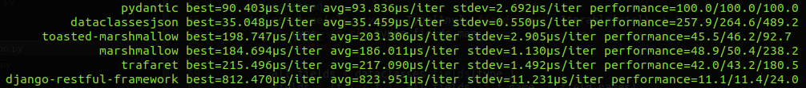

# typingjson

<p align="center" style="margin: 3em">
  <a href="https://github.com/dutradda/typingjson">
    
  </a>
</p>

<p align="center">
    <em>Interoperates <b>dataclasses</b> and <b>TypedDict</b> with <b>json objects</b></em>
</p>

---

**Documentation**: <a href="https://dutradda.github.io/typingjson" target="_blank">https://dutradda.github.io/typingjson</a>

**Source Code**: <a href="https://github.com/dutradda/typingjson" target="_blank">https://github.com/dutradda/typingjson</a>

---


## Key Features

- Full compatibility with [dataclasses](https://docs.python.org/3/library/dataclasses.html) module and [TypedDict](https://www.python.org/dev/peps/pep-0589/) annotation
- Deserialize values from dict
- Deserialize values from bytes*
- Deserialization/serialization of choosen fields
- Dict serialization
- Direct json serialization with [orjson](https://github.com/ijl/orjson) (don't convert to dict before serialization)
- Optional validation according with the [json-schema](https://json-schema.org/) specification*

*\* feature in development.*


## Requirements

 - Python 3.8+
 - [orjson](https://github.com/ijl/orjson) for json serialization


## Instalation
```
$ pip install typingjson
```


## Basic example

```python
from dataclasses import dataclass
from typing import List, TypedDict

from typingjson import (
    as_typed_dict,
    asdataclass,
    dataclass_asjson,
    typed_dict_asjson,
    typingjson,
)


# dataclass


@dataclass
class Music:
    name: str


# if 'Person' is not a dataclass the
# 'typingjson' decorator will call the
# 'dataclass' decorator
@typingjson
class Person:
    name: str
    age: int
    musics: List[Music]


jsondict = dict(name=b'John', age='40', musics=[dict(name='Imagine')])
person = asdataclass(jsondict, Person)

print('dataclass:')
print(person)
print(dataclass_asjson(person))
print()


# TypedDict


@typingjson
class Music(TypedDict):
    name: str


# This decorator is required because
# we need to track the annotations
@typingjson
class Person(TypedDict):
    name: str
    age: int
    musics: List[Music]


jsondict = dict(name=b'John', age='40', musics=[dict(name='Imagine')])
person = as_typed_dict(jsondict, Person)

print('TypedDict:')
print(person)
print(typed_dict_asjson(person, Person))

```

```
dataclass:
Person(name='John', age=40, musics=[Music(name='Imagine')])
b'{"name":"John","age":40,"musics":[{"name":"Imagine"}]}'

TypedDict:
{'name': 'John', 'age': 40, 'musics': [{'name': 'Imagine'}]}
b'{"name":"John","age":40,"musics":[{"name":"Imagine"}]}'

```


## Example for choose fields to deserialize

```python
from dataclasses import dataclass
from typing import List, TypedDict

from typingjson import (
    as_typed_dict,
    asdataclass,
    dataclass_asjson,
    typed_dict_asjson,
    typingjson,
)


@dataclass
class Music:
    name: str


@typingjson(deserialize_fields=('name'))
class Person:
    name: str
    age: int
    musics: List[Music]


jsondict = dict(name=b'John', age='40', musics=[dict(name='Imagine')])
person = asdataclass(jsondict, Person)

print('dataclass:')
print(person)
print(dataclass_asjson(person))
print()


# TypedDict


@typingjson
class Music(TypedDict):
    name: str


@typingjson(deserialize_fields=('name'))
class Person(TypedDict):
    name: str
    age: int
    musics: List[Music]


jsondict = dict(name=b'John', age='40', musics=[dict(name='Imagine')])
person = as_typed_dict(jsondict, Person)

print('TypedDict:')
print(person)
print(typed_dict_asjson(person, Person))

```

```
dataclass:
Person(name='John', age='40', musics=[{'name': 'Imagine'}])
b'{"name":"John","age":"40","musics":[{"name":"Imagine"}]}'

TypedDict:
{'name': 'John', 'musics': [{'name': 'Imagine'}], 'age': '40'}
b'{"name":"John","musics":[{"name":"Imagine"}],"age":"40"}'

```


## Example for choose fields to serialize

```python
from dataclasses import dataclass
from typing import List, TypedDict

from typingjson import (
    as_typed_dict,
    asdataclass,
    dataclass_asjson,
    typed_dict_asjson,
    typingjson,
)


@dataclass
class Music:
    name: str


@typingjson(serialize_fields=('name', 'age'))
@dataclass
class Person:
    name: str
    age: int
    musics: List[Music]


jsondict = dict(name='John', age=40, musics=[dict(name='Imagine')])
person = asdataclass(jsondict, Person)

print('dataclass:')
print(person)
print(dataclass_asjson(person))
print()


# TypedDict


@typingjson
class Music(TypedDict):
    name: str


@typingjson(serialize_fields=('age'))
class Person(TypedDict):
    name: str
    age: int
    musics: List[Music]


jsondict = dict(name=b'John', age='40', musics=[dict(name='Imagine')])
person = as_typed_dict(jsondict, Person)

print('TypedDict:')
print(person)
print(typed_dict_asjson(person, Person))

```

```
dataclass:
Person(name='John', age=40, musics=[Music(name='Imagine')])
b'{"age":40,"name":"John"}'

TypedDict:
{'name': 'John', 'age': 40, 'musics': [{'name': 'Imagine'}]}
b'{"age":40}'

```


## Wins [Pydantic](https://github.com/samuelcolvin/pydantic) Benchmark

`typingjson` is up to *5.6 times* faster than pydantic on it's benchmark


