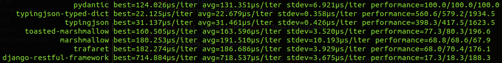

# dataclassesjson

<p align="center" style="margin: 3em">
  <a href="https://github.com/dutradda/dataclassesjson">
    
  </a>
</p>

<p align="center">
    <em>Interoperates <b>@dataclass</b> with <b>json objects</b></em>
</p>

---

**Documentation**: <a href="https://dutradda.github.io/dataclassesjson" target="_blank">https://dutradda.github.io/dataclassesjson</a>

**Source Code**: <a href="https://github.com/dutradda/dataclassesjson" target="_blank">https://github.com/dutradda/dataclassesjson</a>

---


## Key Features

- Full compatibility with [dataclasses](https://docs.python.org/3/library/dataclasses.html) module*
- Deserialize values from dict
- Deserialize values from bytes*
- Deserialization/serialization of choosen fields
- Dict serialization*
- Direct json serialization with [orjson](https://github.com/ijl/orjson) (don't convert to dict before serialization)
- Optional validation according with the [json-schema](https://json-schema.org/) specification*

*\* feature in development.*


## Requirements

 - Python 3.7+
 - [orjson](https://github.com/ijl/orjson) for json serialization (optional, but recommended)


## Instalation
```
$ pip install dataclassesjson[orjson]
```


## Basic example

```python
{!./src/index/index_00_basic.py!}
```

```
{!./src/index/index_00_basic.output!}
```


## Example for choose fields to deserialize

```python
{!./src/index/index_02_deserialize_fields.py!}
```

```
{!./src/index/index_02_deserialize_fields.output!}
```


## Example for choose fields to serialize

```python
{!./src/index/index_03_serialize_fields.py!}
```

```
{!./src/index/index_03_serialize_fields.output!}
```


## Wins [Pydantic](https://github.com/samuelcolvin/pydantic) Benchmark

`dataclassesjson` is *2.5 times* faster than pydantic on it's benchmark


